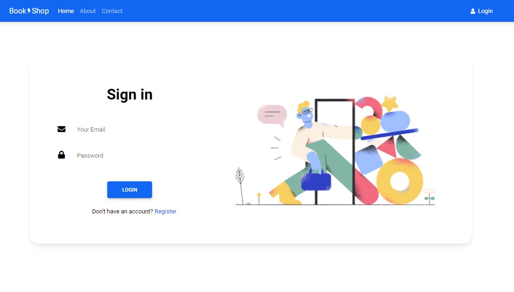
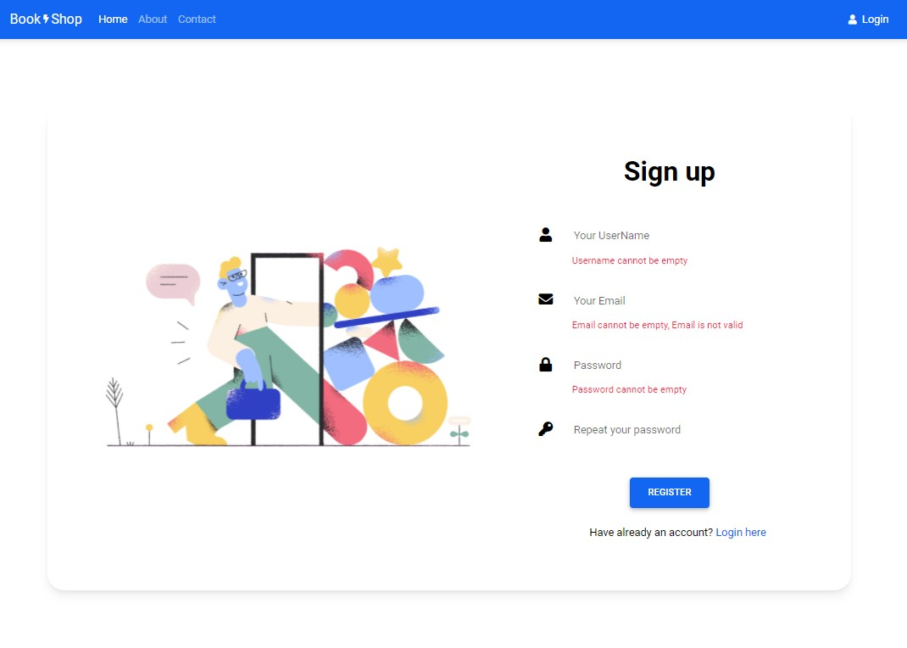
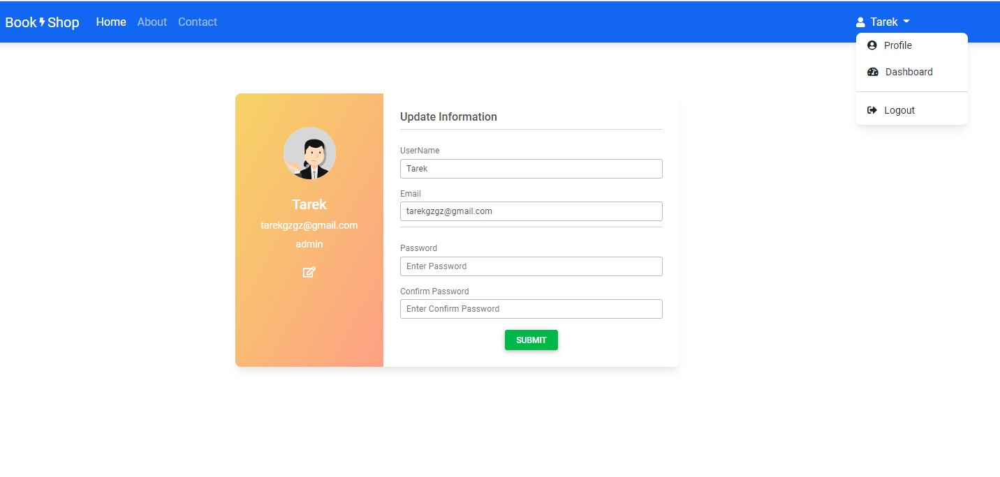
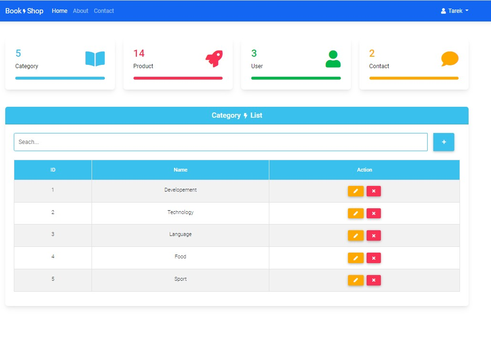
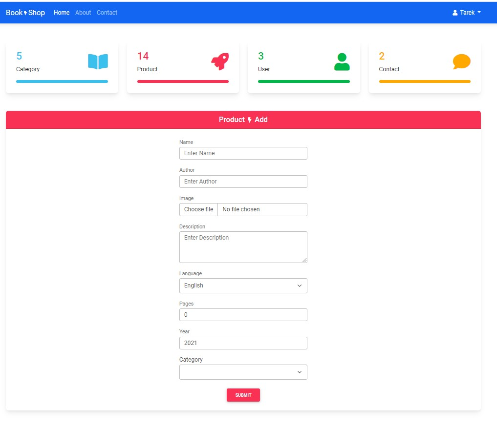
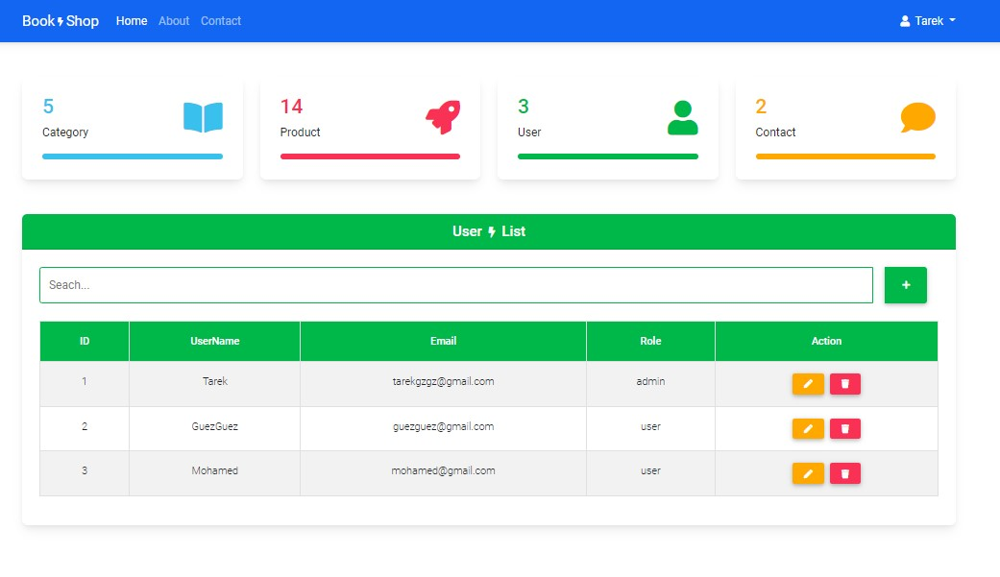
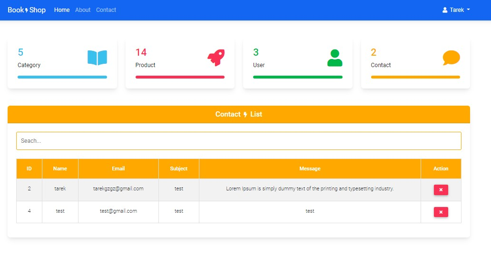
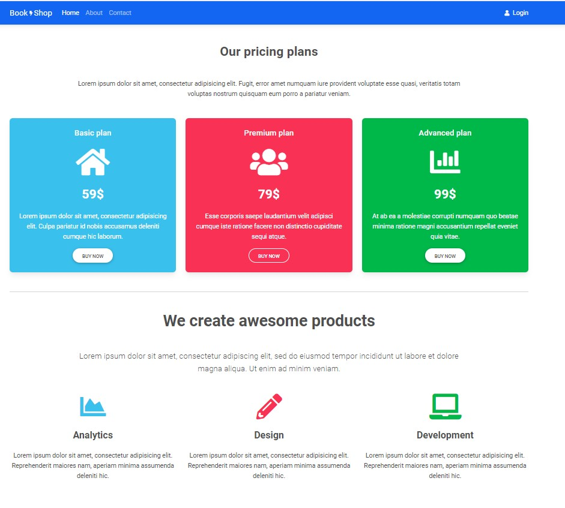
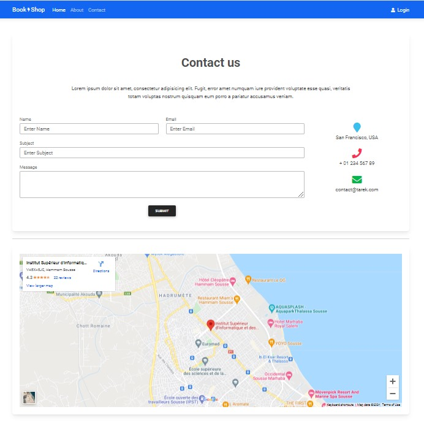

# SpringBoot-Angular
 

<h4>Home Page<h4>

 
  
<h4>Login Page<h4>

 
  
<h4>Register Page<h4>

 
  
<h4>Profile Page<h4>

 
  
<h4>Category Admin Page<h4>

 
  
<h4>Product Admin Page<h4>

 
  
<h4>User Admin Page<h4>

 
  
<h4>Contact Admin Page<h4>

 
  
<h4>About Page<h4>

 
  
<h4>Contact Page<h4>

